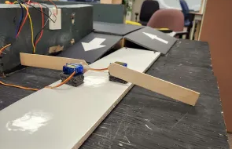
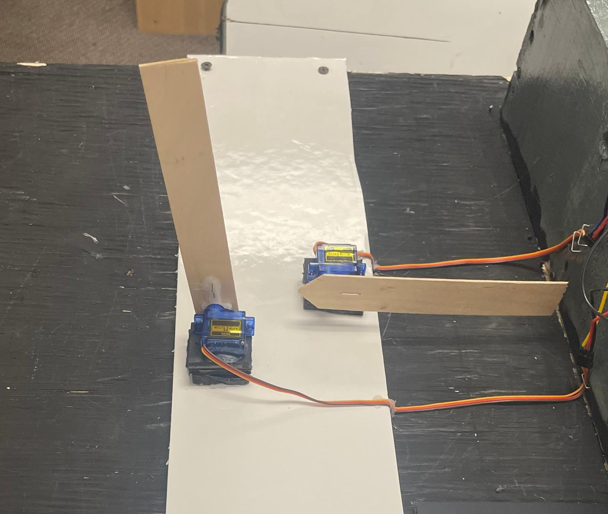
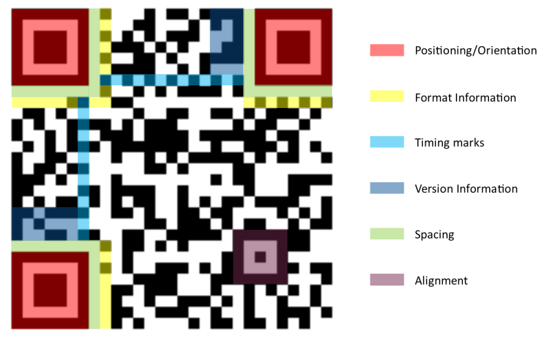
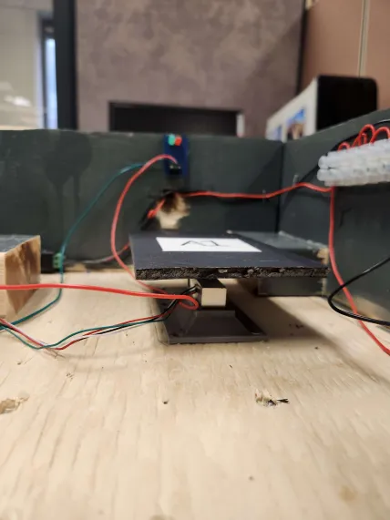
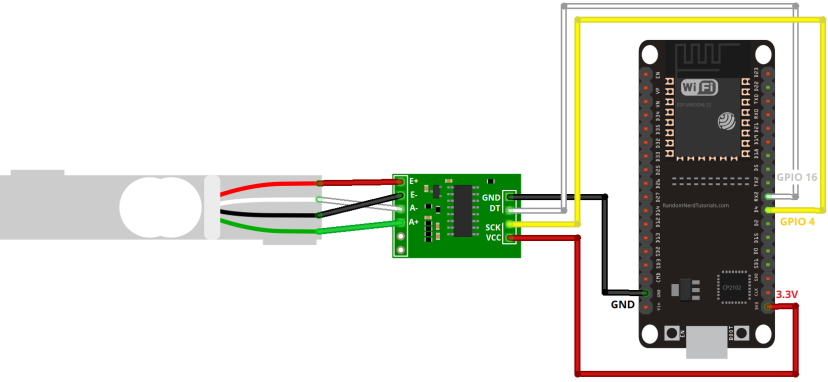
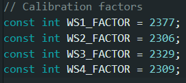
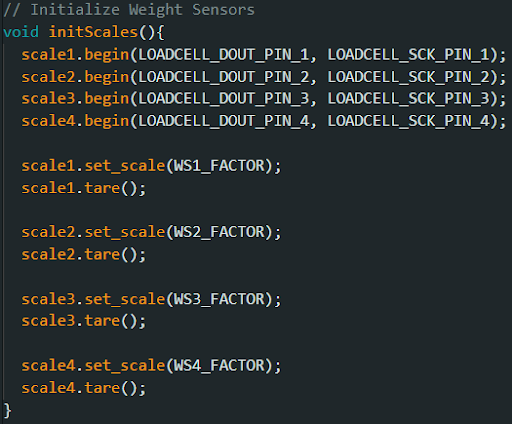
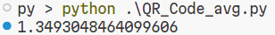

# Automated Parking Management System
## Computer/Electrical Engineering Capstone Design Project

Toronto Metropolitan University, W2024

By:
- Taskin Abdur-Rahman
- Zohraan Badar
- Kisoban Rajendran
- Yadu Krishnan Madhu

---

## Acknowledgement
We would like to express our sincere gratitude to all those who contributed to the successful completion of this engineering design report. Special thanks to:
- **Dr. Alagan Anpalagan**, The Faculty Lab Coordinator (FLC), for his guidance and assistance.
- **ECB Department**, for facilitating the capstone design project experience.

We also appreciate the support of our peers and the resources provided by the **Faculty of Engineering and Architectural Science**.

---

## Certification of Authorship
“I hereby certify that I/we are the author(s) of this document, and any assistance I/we received in its preparation is fully acknowledged. All sources are properly cited.”

- **Taskin Abdur-Rahman**
- **Zohraan Badar**
- **Kisoban Rajendran**
- **Yadu Krishnan Madhu**

---

## Table of Contents
1. [Acknowledgement](#acknowledgement)
2. [Certification of Authorship](#certification-of-authorship)
3. [Abstract](#abstract)
4. [Introduction & Background](#introduction--background)
5. [Objectives](#objectives)
6. [Theory and Design](#theory-and-design)
    - [Parking Lot Authentication](#parking-lot-authentication)
    - [QR-Code](#quick-response-qr-code)
    - [Parking Presence Detection](#parking-presence-detection)
    - [Firebase](#firebase-baas)
7. [Material/Component list](#materialcomponent-list)
8. [Measurement and Testing Procedures](#measurement-and-testing-procedures)
9. [Analysis of Performance](#analysis-of-performance)
10. [Conclusion](#conclusion)
11. [References](#references)

---

## Abstract
Parking lots, especially in areas like airports, malls, and downtown, face congestion due to unorganized traffic flow. This report proposes an **Automated Parking Management System (APMS)** using IoT technology and sensors for touch-free parking automation, authentication, and real-time monitoring.

The system includes:
- QR code authentication
- Automatic license plate recognition
- Predictive analytics for spot availability

This design improves cost-efficiency and security. Alternative methods like **RFID technology** are explored to enhance performance.

---

## Introduction & Background
Parking lots are often crowded, especially in high-traffic areas such as airports or malls. This project aims to create a fully automated parking management system that is **touch-free, time-efficient**, and **user-friendly**.

The parking system will:
- Automate parking spot monitoring using sensors
- Provide QR code-based entry and exit authentication
- Enable users to book parking spots through a **web application**

---

## Objectives
Key objectives for the **Automated Parking Management System (APMS)** include:
- Automating parking lot processes using **IoT** and **real-time data**.
- Providing a **GUI** for booking and predicting spot availability.
- Supporting multiple types of parking spots (e.g., regular, premium, disabled).

---

## Theory and Design

### Parking Lot Authentication
Users authenticate using **QR Codes** at the parking lot gate. The **ESP32-CAM** captures the QR code, uploads it to a cloud database, and a server opens the gate if valid.

### Quick Response (QR)-Code
QR codes store data in a two-dimensional grid, scanned by smartphones. This allows for touch-free entry into the parking lot.

### Parking Presence Detection
A **weight sensor** detects when a car occupies a spot, updating the system and triggering lights to indicate availability.

### Firebase (BaaS)
Firebase is used to manage real-time databases, authentication, and cloud storage for the parking lot system.

---

## Material/Component List
**Table 1.00 - List of materials and components**
| Description                                                                                             | Part #         | Quantity | Unit Cost | Subtotal | Total  |
|---------------------------------------------------------------------------------------------------------|----------------|----------|-----------|----------|--------|
| 2PC ESP32-CAM-MB                                                                                        | 2_XF01022_US   | 2        | 34.99     | 34.99    | 39.54  |
| ELEGOO 3pcs Breadboard 830 Point Solderless Prototype PCB Board Kit for Arduino Proto Shield Distribution | BB830          | 1        | 16.99     | 16.99    | 19.20  |
| Freenove Breakout Board for ESP32 / ESP32-S3 WROVER WROOM, Terminal Block Shield with Pin Header         | FNK0091        | 2        | 35.90     | 35.90    | 40.56  |
| 1KG Digital Load Cell Weight Sensor + HX711 Weighing Sensors Ad Module for Arduino 1kg 5kg 10kg 20kg     | N/A            | 6        | 3.32      | 19.92    | 22.51  |
| 5mm Red LED – Super Bright – 624nm                                                                       | C503B-RCN-CW0Z0AA1 | 4     | In-house  | In-house | In-house |
| Mini Breadboard - White                                                                                  | C503B-RCN-CW0Z0AA1 | 1     | 4.00      | 4.00     | 4.52   |
| 22 AWG Wire 100 ft                                                                                       | N/A            | 1        | In-house  | In-house | In-house |
| 14mm M4 Screw (4 pack)                                                                                   | YSCRE-414144   | 1        | 1.50      | 1.50     | 1.67   |
| 5V 1A Switching Power Supply                                                                             | ADADC-400505   | 1        | 12.00     | 12.00    | 13.56  |
| Basic Screwdriver Set (6pcs)                                                                             | TOOSC-322027   | 1        | 4.50      | 4.50     | 5.08   |
| 3PC Screw Terminal Block                                                                                 | TERMB-008235   | 6        | 12.00     | 12.00    | 13.56  |
| 2.1mm DC Barrel (F) to Terminal block                                                                    | ADADC-010288   | 1        | 2.50      | 2.50     | 2.80   |
| Solid Rosin Flux                                                                                         | SOLDF-511001   | 1        | 3.50      | 3.50     | 3.95   |
| Leadfree Solder - 100g                                                                                   | SOLDR-009325   | 1        | 13.00     | 13.00    | 14.69  |
| M5 Screw                                                                                                 | N/A            | 4        | In-house  | In-house | In-house |
| White Screw Terminal Block Dual Row Electric Barrier Block 12-Position Terminal Strip, 10 Amp 380 V      | N/A            | 2        | 3.29      | 6.58     | 7.43   |
| Black electrical tape                                                                                    | N/A            | 1        | In-house  | In-house | In-house |

---

## Measurement and Testing Procedures
**Weight Sensor Calibration** is performed using known weights and measuring the sensor’s response to establish a baseline for car detection.

---

## Performance Measurement Results
QR code reading performance was measured in three categories:
1. **Digitally generated images**: 100% success rate.
2. **Real-time images**: Limited success with ESP32-CAM.
3. **Use case performance**: High failure rate due to poor image quality.

---

## Conclusion
The **Automated Parking Management System (APMS)** offers a reliable, user-friendly solution to parking lot congestion. Future improvements may include exploring **RFID technology** and refining QR code detection for better performance.

---

## References
- The Collaborative Interface Design Tool. Figma. (n.d.). [https://www.figma.com/](https://www.figma.com/)
- S. Gören, D. F. Óncevarlk, K. D. Yldz, and T. Z. Hakyemez, "On-Street Parking Spot Detection for Smart Cities," 2019 IEEE International Smart Cities Conference (ISC2), Casablanca, Morocco, 2019, pp. 292-295. doi: [10.1109/ISC246665.2019.9071760](https://doi.org/10.1109/ISC246665.2019.9071760).
- Keras, "Keras: The Python Deep Learning library," [online] Available: [https://keras.io/](https://keras.io/)
- Google. (n.d.). Google. [https://firebase.google.com/](https://firebase.google.com/)
- React. (n.d.). [https://react.dev/](https://react.dev/)
- Tiwari, Sumit. (2016). An Introduction to QR Code Technology. 39-44. doi: [10.1109/ICIT.2016.021](https://doi.org/10.1109/ICIT.2016.021)
- Kuphaldt, T. R. (2015, February 12). Strain Gauges: Electrical Instrumentation Signals: Electronics Textbook. All About Circuits. [https://www.allaboutcircuits.com/textbook/direct-current/chpt-9/strain-gauges/](https://www.allaboutcircuits.com/textbook/direct-current/chpt-9/strain-gauges/)
- ESP32 - RFID/NFC. ESP32 Tutorial. (n.d.). [https://esp32io.com/tutorials/esp32-rfid-nfc](https://esp32io.com/tutorials/esp32-rfid-nfc)
- Smiley, S. (2022, May 13). What is Passive RFID?. atlasRFIDstore. [https://www.atlasrfidstore.com/rfid-insider/what-is-passive-rfid/](https://www.atlasrfidstore.com/rfid-insider/what-is-passive-rfid/)
- CD-Tonics For You. [https://www.electronicsforu.com/technology-trends/learn-electronics/ir-led-infrared-sensor-basics](https://www.electronicsforu.com/technology-trends/learn-electronics/ir-led-infrared-sensor-basics)

This `README.md` gives a summary of the project. For detailed report go to [Final EDP Report.](./Final_EDP_Report.pdf)
